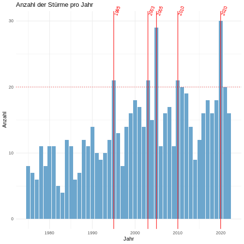

:::::::::::::::::::::::::::::::::::::: questions

- Wie visualisiere ich Daten?

::::::::::::::::::::::::::::::::::::::::::::::::

::::::::::::::::::::::::::::::::::::: objectives

- Datenvisualisierung mit `ggplot2`

::::::::::::::::::::::::::::::::::::::::::::::::

Die Visualisierung von Daten ist ein wichtiger Bestandteil der Datenanalyse, da sie es ermöglicht, Muster und Zusammenhänge in den Daten zu erkennen und zu kommunizieren.
In R wird die Visualisierung von Daten mit dem `ggplot2` Paket durchgeführt, das auf der [*Grammar of Graphics*](https://r4ds.had.co.nz/data-visualisation.html) basiert.
Hierbei müssen die Daten in tabellarischer Form vorliegen, d.h. jede Zeile entspricht einem Datensatz und jede Spalte einer Variable ("tidy data").

Die Visualisierung von Daten wird in verschiedene Schichten (z.B. Punkte, Linien, Balken) und Eigenschaften (z.B. x-Achse, y-Achse, Farbe, Form) unterteilt.
Die Verküpfung von Tabellenspalten mit den Ebenen und Eigenschaften (d.h. Welche Information wird wie fürs Plotting verwendet) erfolgt über das Argument `mapping = ` und die `aes()` Funktion.
Schichten (z.B. Balken, Linien, Punkte) werden mit `geom_*()` Funktionen hinzugefügt, wobei die Daten für die Schicht über das Argument `data = ` übergeben werden.

Im Folgenden wird ein umfangreiches Beispiel für die Visualisierung von Daten mit `ggplot2` gezeigt, bei dem die Anzahl der Stürme pro Jahr visualisiert wird.


``` r
# Beispiel: Anzahl der Stürme pro Jahr visualisieren

# Rohdatensatz startet Visualisierungsworkflow
storms |>

  ########### Datenvorbereitung #############

  # auf einen Eintrag (Zeile) pro Sturm und Jahr reduzieren
  distinct(year, name) |>
  # Anzahl der Stürme pro Jahr zählen
  group_by(year) |>
  count() |>
  ungroup() |>

  ########### Datenvisualisierung #############

  # ggplot-Objekt erstellen (Daten via pipe übergeben)
  ggplot(mapping = aes(x = year, y=n)) + # Verknüpfung von Datenspalten (year, n) und Achsen (x,y)
  # Diagrammtitel und Achsenbeschriftung
  labs(title = "Anzahl der Stürme pro Jahr", x = "Jahr", y = "Anzahl") +
  # grundlegende Diagrammformatierung (Hintergrundfarben, Schriftarten, ...)
  theme_minimal() +
  # Balkendiagramm mit Anzahl der Stürme pro Jahr
  geom_bar(fill="skyblue3", stat = "identity") +
  # gepunktete horizontale Linie bei 20
  geom_hline(yintercept = 20, linetype="dotted", col="red") +
  # Highlighting der Jahre mit mehr als 20 Stürmen
  geom_vline(data = ~ filter(.x, n>20),  # Datensatz einschränken
            # (hier `.x` = Platzhalter für Daten aus vorheriger Ebene, d.h. `storms`)
            aes(xintercept=year), # welche (Teil)Tabellendaten für Position zu verwenden
            color="red") + # Zusätzliche Formatierung
  # Jahreszahlen der Jahre mit mehr als 20 Stürmen in schräger Textausrichtung
  geom_text(data = ~ filter(.x, n>20), # Datensatz einschränken
            aes(label=year, x=year, y=max(n)), # Daten und Positionen festlegen
            angle=70, vjust=0.5, hjust=-0.6, size=3, color="red") + # Textformatierung
  # disable clipping um Jahreszahltexte außerhalb des Diagrammbereichs anzuzeigen
  coord_cartesian(clip = "off")
```




``` r
# optional: (zuletzt gemaltes) Diagramm speichern
ggsave("storms_per_year.png", width=10, height=5, dpi=300)
```


Als Nachschlagewerk empfiehlt sich das offizielle Cheat Sheet des `ggplot2` Pakets, welches die wichtigsten Funktionen und Argumente übersichtlich darstellt: 

[{width="100%" alt="CLICK TO ENLARGE: cheat sheet for ggplot2 ackage"}](https://raw.githubusercontent.com/rstudio/cheatsheets/main/data-visualization.pdf)

::::::::::::: challenge

## Sturmposition visualisieren

Zeichnen sie ein Punktdiagram, welches für folgenden Datensatz 

- Länge (x-Achse) und Breite (y-Achse) der Messung zeigt und die Punkte anhand des Sturmstatus einfärbt,
- die Achsen mit "Länge" und "Breite" beschriftet, und
- den Diagrammtitel "Sturmposition" hat.


``` r
storms |> 
  group_by(name,year) |> 
  slice_tail(n=1) |> 
  # .. TODO: ggplot2 code hier einfügen ..
```


:::::: solution


``` r
storms |> 
  group_by(name,year) |> 
  slice_tail(n=1) |> 
  ggplot(mapping = aes(x = long, y = lat, color = status)) +
  geom_point() +
  labs(
    title="Sturmposition",
    x="Länge",
    y="Breite",
    color="Status" # ansonsten klein geschrieben
  )
```


``` r
# alternatively
# geom_title("Sturmposition") + geom_xlab("Länge") + geom_ylab("Breite") + geom_color("Status")
```

:::::::::::::::

:::::::::::::::::::::::


::::::::::::::::::::::::::::::::::::: keypoints

- `ggplot2` benötigt einen `data.frame` als Eingabe, welcher "tidy" ist (d.h. eine Zeile pro Beobachtung und eine Spalte pro Variable).
- Das `mapping` Argument ermöglicht mittels der `aes()` Funktion die Verknüpfung von Variablen des Datensatzes (d.h. Spaltennamen) mit visuellen Eigenschaften (z.B. x-Achse, Farbe, Größe).
- `geom_*` Funktionen fügen dem Plot Schichten hinzu (z.B. Punkte, Linien, Balken).
- `labs()` ermöglicht die Anpassung von Diagrammtitel und Achsenbeschriftung.
- `theme_*` Funktionen ermöglichen die Anpassung genereller Diagrammformatierungen (z.B. Hintergrundfarben, Schriftarten).
- Es gibt viele weitere Funktionen und Argumente, um die Darstellung von Diagrammen zu verfeinern (z.B. `facet_wrap()`, `scale_*`, `coord_*`).
- Diagramme mit `ggsave()` in beliebigem Dateiformat (PNG, PDF, SVG, ..) speichern.
- Ausserdem gibt es viele Erweiterungen für `ggplot2` (z.B. `ggplotly`, `ggrepel`), die zusätzliche Funktionalitäten oder Visualisierungstypen/-diagramme bieten.
- Zusammenfassung im [`ggplot2` Cheat Sheet](https://raw.githubusercontent.com/rstudio/cheatsheets/main/data-visualization.pdf)

::::::::::::::::::::::::::::::::::::::::::::::::

-----------------------------------------------

Dieses Dokument wurde mit Unterstützung von GitHub Copilot erstellt, einem KI-gestützten Autocompletion-Tool, das auf der OpenAI GPT-3-Technologie basiert.

